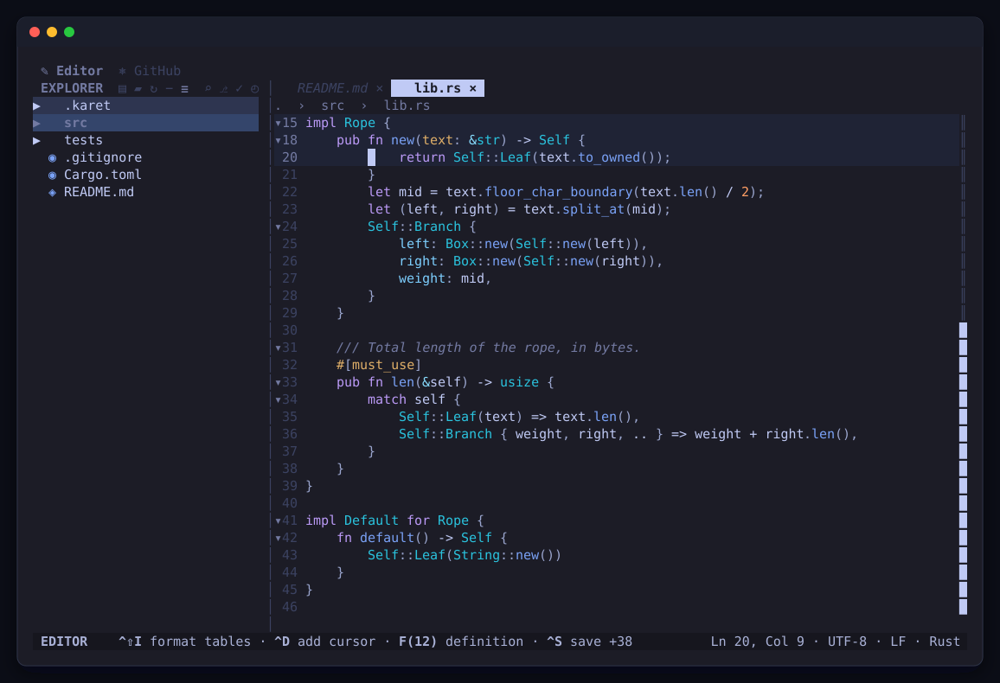

# karet

<p align="center">
  
</p>

`karet` is a TUI for high-velocity, terminal-centric coding, focused on review
and visualization tools. It is an application that should feel more like a GUI in
the terminal: spatial, keyboard-first, and composed from reusable Rust libraries.

This repository is also a Cargo workspace of reusable primitives ("engines") for
building TUI code editors and coding tools, plus the `karet` application that
composes them.

## Who is it for?

- **`karet`** — a high-velocity TUI application for terminal-centric coding
  workflows, especially review and visualization.
- **The `karet-*` libraries** — reusable, presentation-free building blocks for
  coding tools, so downstream consumers can pick the pieces they need without
  inheriting the full application.

## Design principles

One idea runs through the workspace: **accommodate where it counts, and be
opinionated where a sane default serves everyone.** We stay flexible on what a
downstream consumer actually feels — engines are **headless** (no `ratatui` unless
you opt into a `view` feature), keep a **minimal dependency footprint** so you can
pick a small subset, emit **neutral models** that any renderer can consume, and
depend only on **pure-Rust** crates. And we stay opinionated where choice is just
surface area — a crate must **earn its existence** through real standalone reuse,
**publishing** is a stricter bar than merely being a separate crate, we **commit to
one best backend** (tree-sitter for syntax), and the quality floor (nightly rustfmt,
no `unwrap`/`expect`/`panic` in libraries) is **non-negotiable**. See
[`AGENTS.md`](AGENTS.md) for the full treatment.

## `karet` — terminal coding TUI

The `karet` binary currently opens review-oriented terminal workflows around a
workspace path:

```bash
karet [PATH]        # open the repo or workspace containing PATH
karet --staged      # start from the staged diff (HEAD vs index)
karet src/main.rs   # scope review to a single path
```

For git review, it shows staged changes if any are staged, otherwise the unstaged
(working-tree) changes — like VS Code's default. It prints a message and exits if
`PATH` is not in a git repository or there is nothing to show. In the viewer: `j`/`k`
scroll, `h`/`l` switch file, `Tab` toggles unified / side-by-side, `q` quits.
Syntax highlighting is tree-sitter-based, with bundled grammars for over fifty
languages — Rust, Python, JS/TS, Go, Java, C/C++, C#, and the rest of the table
in [`docs/file-formats.md`](docs/file-formats.md); language-server support per
language is in [`docs/language-servers.md`](docs/language-servers.md). The
detected language is shown in the status bar, and unknown/unsupported languages
render as plaintext. `--no-syntax` (or `NO_COLOR`) disables highlighting.

On a Markdown file, `Ctrl+K V` (or "Markdown: Toggle Preview to the Side" in the
command palette) opens a rendered preview in a pane to the right. It re-renders as
you type, and the two panes scroll together — whichever one has focus leads.

- **Seam view** (`Ctrl+K S`) — read a repository by its *seams*, not its files: one
  navigable tree of what's exposed, what can be swapped, what varies before compile,
  what crosses the package line, and where that's dangerous. A workspace, nested crates,
  and Python packages beside them all become one tree with a root per package; open it
  somewhere narrower with **Seam: Open Seam View at…**. The same query language
  drives the filter box and `karet --seam-query`, so what you narrow to by hand is
  exactly what a script can ask for. See [`docs/seam.md`](docs/seam.md).

## Prerequisites

- [Rust (rustup)](https://rustup.rs) — toolchain (stable pinned in `rust-toolchain.toml`; the rustfmt-only nightly in `rust-nightly.txt`)
- [mise](https://mise.jdx.dev) — task runner and tool manager
- [hk](https://hk.jdx.dev) — git hooks manager (installed by `mise install`)
- [pkl](https://pkl-lang.org) — config language for `hk.pkl` (installed by `mise install`)
- [cargo-llvm-cov](https://github.com/taiki-e/cargo-llvm-cov) — code coverage (installed by `mise install`)

## Getting Started

```bash
mise install        # provision hk, pkl, and cargo-llvm-cov
hk install          # activate git hooks
cargo build
```

Run the editor with `cargo run -- <path>`. Icons default to Nerd Font glyphs;
pass `--icons unicode` or `--icons ascii` (or set `KARET_ICONS`) if your terminal
font lacks them. See [docs/file-formats.md](docs/file-formats.md) for the catalogue
of recognized file types, icons, and syntax-highlighting support.

Optional spellcheck is disabled by default. Enable it in `setting.jsonc` after
installing an `en_US` or `en_GB` Hunspell dictionary; the **Spelling** sidebar panel
(`Ctrl+4`) then lists every misspelling across the workspace, and selecting one opens
its file at the word. The [configuration guide](docs/configuration.md#spellcheck)
documents dictionary lookup, EditorConfig selection, scopes, and package-size
trade-offs.

LaTeX source has tree-sitter highlighting and an external-tool workflow: install
`latexmk`, then run **LaTeX: Build and Open PDF Preview** from the command palette.
The pending preview opens immediately and fills with the generated PDF. Root-file
comments, custom recipes, build-on-save, timeouts, and optional `texlab` language
features are covered in the [LaTeX settings](docs/configuration.md#latex). Most
built-in language servers can be installed through karet's
[explicit, machine-local registry](docs/language-servers.md). Servers coupled to a
project SDK/runtime are named as manual in the manager; no compiler or TeX runtime
is bundled with karet.

Use **Language Servers: Manage** from the command palette for the complete
per-repository inventory and explicit install, update, restart, and safe-uninstall
controls.

Warnings, errors, and the application's tracing diagnostics are written to daily
`karet.log.*` files in the platform-standard Karet state directory (falling back to
the local data directory). The seven most recent log files are retained; set
`RUST_LOG` to adjust tracing verbosity. Run `karet --log` to print the paths of
the log files that currently exist.

## Development

| Command             | Description          |
| ------------------- | -------------------- |
| `cargo build`       | Build the crate      |
| `mise run test`     | Run tests            |
| `mise run format`   | Format code          |
| `mise run lint`     | Lint (deny warnings) |
| `mise run lint-fix` | Lint and auto-fix    |
| `mise run coverage` | Report coverage      |
| `mise run verify`   | Run the CI/pre-push quality gate |
| `mise run svg`      | Recapture the README hero SVG    |

The hero image is a real frame, not a drawing: `mise run svg` builds `karet`, runs it
with `--capture` against a throwaway demo repository, and converts the ANSI grid it
prints into `assets/karet.svg`. Because the demo repository is generated with pinned
content, branch, and commit dates — and the capture runs with an empty environment
and a throwaway `HOME` — re-running it is byte-identical. See `scripts/gen-svg.sh`.

Tests live in-file (`#[cfg(test)] mod tests`); test every new public item. Headless
engines carry the bulk of the coverage, widget crates render-test into a ratatui
`Buffer`, and coverage is a signal rather than a merge gate. See the per-package
[testing policy](AGENTS.md#testing-policy) in `AGENTS.md`.

## Tech Stack

- **Language:** Rust (edition 2024)
- **Task runner / tools:** mise
- **Formatter / Linter:** rustfmt + Clippy
- **Git hooks:** hk
- **Key Dependencies:** tracing, thiserror, tokio

## Git Hooks

This project uses [hk](https://hk.jdx.dev). The pre-commit hook auto-fixes formatting
and lint on staged Rust files; the pre-push hook runs `mise run verify`, the same
file-size, format, lint, test, lean-build, and coverage gate as CI. The commit-msg
hook validates the message against
[Conventional Commits](https://www.conventionalcommits.org) with
[convco](https://convco.github.io) — merge/revert-in-progress commits are exempt.

## CI/CD

GitHub Actions runs `mise run verify` on pushes to `master` and on pull requests,
including stacked pull requests whose base is another feature branch. The job uploads
the generated `lcov.info` coverage artifact.

## Code Coverage

This project uses [`cargo-llvm-cov`](https://github.com/taiki-e/cargo-llvm-cov) for
LLVM-based code coverage.

```bash
mise run coverage
```

### MSRV

Rust 1.92 (the workspace `rust-version`); development and CI compile on the
toolchain pinned in `rust-toolchain.toml`.

## Versioning

Commits follow [Conventional Commits](https://www.conventionalcommits.org) (enforced by
[convco](https://convco.github.io) in the commit-msg hook and in CI on pull requests).
Version bumps, CHANGELOGs, git tags, and crates.io publishing are automated by
[release-plz](https://release-plz.dev); publishing uses crates.io
[Trusted Publishing](https://crates.io/docs/trusted-publishing) (OIDC) — no long-lived tokens.

Two release lines coexist:

- **The `karet-*` crates release in lockstep** under one synchronized workspace version
  (`version.workspace = true`). Fourteen of them are published to crates.io — `karet-core`,
  `karet-text`, `karet-treesitter`, `karet-syntax`, `karet-theme`, `karet-diff`,
  `karet-filetype`, `karet-pdf`, `karet-jsonrpc`, `karet-lsp`, `karet-vcs`, `karet-search`,
  `karet-editor`, `karet-fileview` — and the rest are `publish = false`. See the crate
  table in [`AGENTS.md`](AGENTS.md) for the full breakdown.
- **[`blameline`](crates/blameline) is a standalone library on its own SemVer line**,
  published on an independent cadence; see [its README](crates/blameline/README.md).

## Contribution Policy

Issues will receive a response within one week. Karet tools and libraries will
remain open-source and publicly available.

## License

Licensed under either of [MIT](LICENSE-MIT) or [Apache-2.0](LICENSE-APACHE) at your option.
